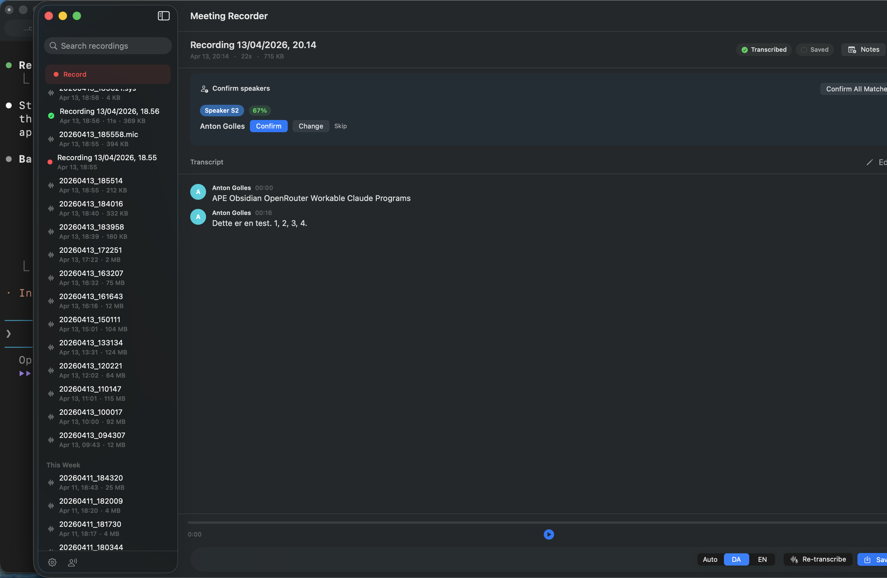

# Meeting Recorder

Local-first macOS meeting recorder with on-device transcription and speaker recognition.

[](https://github.com/tonton-golio/meeting-recorder/actions/workflows/build.yml)


[](LICENSE)



## Features

- **Record mic + system audio** -- captures both sides of video calls via ScreenCaptureKit
- **On-device transcription** -- WhisperKit (CoreML) with model sizes from tiny (75 MB) to large-v3 (2.9 GB)
- **Speaker diarization** -- FluidAudio identifies who said what, with a learnable voice library that improves over time
- **Obsidian-compatible output** -- structured markdown with YAML frontmatter and `[[wikilinks]]` for speaker pages
- **Menu bar app** -- lives in the menu bar with a global hotkey (Ctrl+Opt+R) for quick recording
- **Crash recovery** -- two-phase pipeline checkpoints expensive transcription work so crashes don't lose progress
- **Auto-transcribe, auto-save** -- configurable automation with retention policies (7-90 days)
- **Fully local** -- no cloud APIs, no internet required after initial model download

## Requirements

- macOS 14+ (Sonoma)
- Apple Silicon (M1 or later)
- Xcode 15.3+ / Swift 5.10+ (for building from source)
- No Apple Developer account needed (ad-hoc code signing)

## Build & Install

```bash
git clone https://github.com/tonton-golio/meeting-recorder.git
cd meeting-recorder/swift
./build.sh
open -a "Meeting Recorder"
```

The build script compiles via SPM, bundles a `.app`, ad-hoc signs it, and installs to `/Applications`. First build downloads dependencies and may take a few minutes.

On first launch, macOS will prompt for two permissions:
1. **Microphone** -- required for recording
2. **Screen Recording** -- needed to capture system audio (the remote side of video calls). Optional: the app falls back to mic-only if denied.

## How it works

1. **Record** -- captures microphone audio (and optionally system audio) as 16kHz mono WAV
2. **Transcribe** -- WhisperKit runs Whisper locally via CoreML, producing timestamped text segments
3. **Diarize** -- FluidAudio clusters audio into speakers and extracts WeSpeaker embeddings (256-dim vectors)
4. **Match** -- each speaker embedding is compared against the People voice library using cosine similarity. Known voices are auto-labeled; unknown speakers are presented for identification.
5. **Save** -- the transcript is written as Obsidian-compatible markdown with YAML frontmatter

See [docs/SPEC.md](docs/SPEC.md) for the full product specification.

## Data storage

All data lives locally under `~/.meeting-recorder/`:

```
~/.meeting-recorder/
  recordings/
    recordings.json          # recording index
    *.wav                    # audio files
  people/
    people.json              # people index
    {uuid}/                  # per-person directory
      {sample-uuid}.caf     # voice samples
  meetings/
    *.md                     # saved markdown transcripts
```

## Architecture

The app is a SwiftUI menu bar application with a central `AppState` coordinator that owns the recording, transcription, people-matching, and playback subsystems. See [CLAUDE.md](CLAUDE.md) for a detailed architecture overview and component guide.

## Acknowledgments

- [WhisperKit](https://github.com/argmaxinc/WhisperKit) by argmaxinc -- on-device speech-to-text via CoreML
- [FluidAudio](https://github.com/FluidInference/FluidAudio) by FluidInference -- on-device speaker diarization and embeddings

## License

[MIT](LICENSE)
